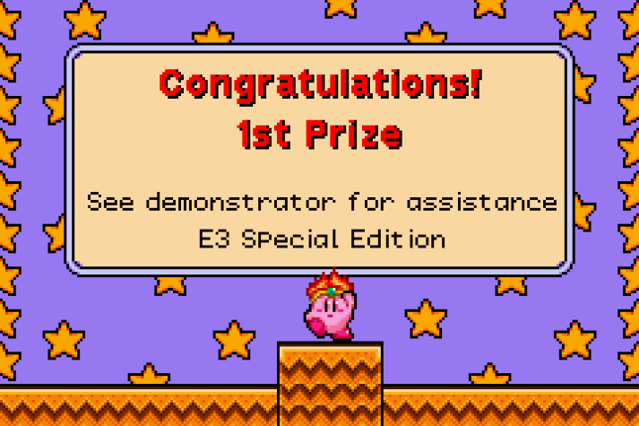

This is a fork of d1x's "Promotional Kirby Contest Card (Loser) Disassembly", found here:
https://github.com/d1x/ereader-card-disassemblies/tree/master/kirby-contest-card-loser


It is a recreation of the 1st Prize Kirby Contest e-Reader Card from e3 2002.
It is important to note that the hash for the recreation is not going to match that of the official card, as the compression is not going to be exactly the same.

CRC: 9FB68A8E

However, the purpose of this project is to fully recreate the experience.



The image displayed on the screen when this card is loaded onto the e-Reader is the official image of the 1st Prize Kirby card, and was obtained through a screenshot shared by Nintendo.

Previously, the song included in this repo had been guessed, and picked out to try and match what a 'winning' sound would sound like when compared to the other 2 prize cards.
However, a first place card has surfaced, and you can [see a video of it in action here](https://www.youtube.com/watch?v=k32f2YrOsJs).
All songs are loaded from the e-Reader itself.

This one is `0x00fb`.

    ; CONSTANTS

    input_register = 0x9f02
    system_sound = 0x00fb

Change the value of `system_sound` to change the music


## How to build

* Download [SDCC](http://sdcc.sourceforge.net/)
* Download [nedcmake](https://www.caitsith2.com/ereader/tools/nedcmake.rar) from [caitsith2.com E-Reader Development Tools](https://www.caitsith2.com/ereader/devtools.htm)

Compile:
```
sdasz80.exe -l -o -s -p main.o main.asm
```

Link:
```
sdldz80.exe -n -- -i main.ihx main.o
```

Make binary:
```
makebin.exe -p < main.ihx > main.z80
```

Remove first 256 bytes of `main.z80` in your editor of choice and save it as `main.bin`.

To run in an emulator: generate `RAW`:
```
nedcmake.exe -i main.bin -o us -type 1 -region 1 -raw
```

To run on real hardware: generate `BMP`:
```
nedcmake.exe -i main.bin -o us -type 1 -region 1 -bmp
```